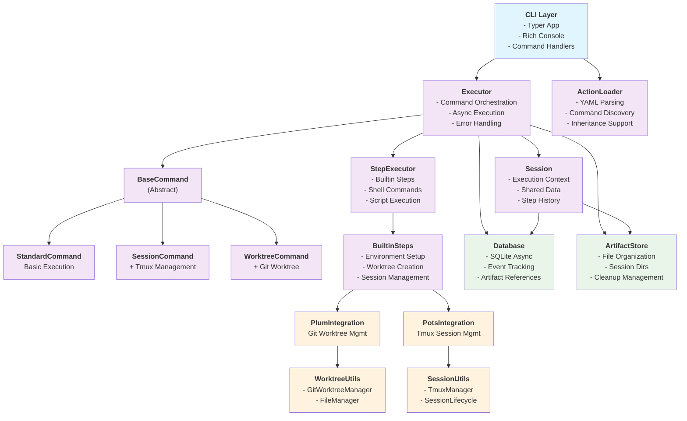

# PruneJuice System Architecture

This diagram shows the overall system architecture with clear layered separation between CLI, core logic, integrations, and utilities.

## Key Architectural Patterns

1. **Layered Architecture**: Clear separation between CLI, core logic, integrations, and utilities
2. **Factory Pattern**: Used for creating appropriate command types (Standard/Session/Worktree)
3. **Strategy Pattern**: Step execution supports multiple types (builtin/shell/script)
4. **Repository Pattern**: Database operations are properly abstracted
5. **Async-First Design**: Throughout the execution pipeline for performance