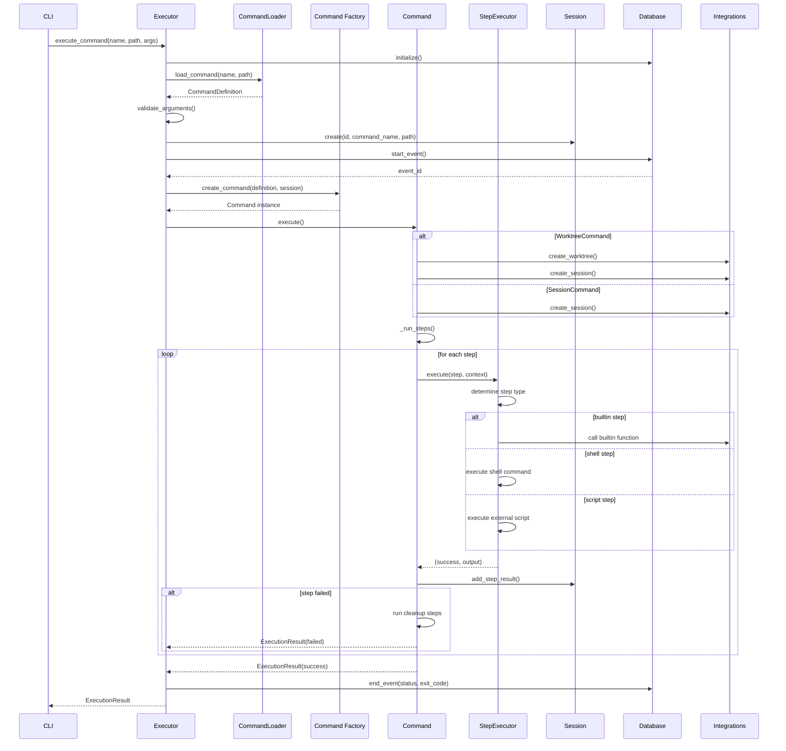

# PruneJuice Command Execution Flow

This sequence diagram shows the complete flow of command execution from CLI invocation through to completion, including the interactions between all major components.

## Execution Flow Phases

1. **Initialization**: Database setup and command loading from YAML
2. **Validation**: Argument validation and session creation
3. **Command Factory**: Automatic selection of command type (Standard/Session/Worktree)
4. **Resource Management**: Automatic creation of worktrees and tmux sessions as needed
5. **Step Execution**: Sequential execution of pre_steps → steps → post_steps
6. **Error Handling**: Automatic cleanup on failure
7. **Persistence**: Event tracking and artifact storage

The flow demonstrates the system's robust error handling and automatic resource management capabilities.