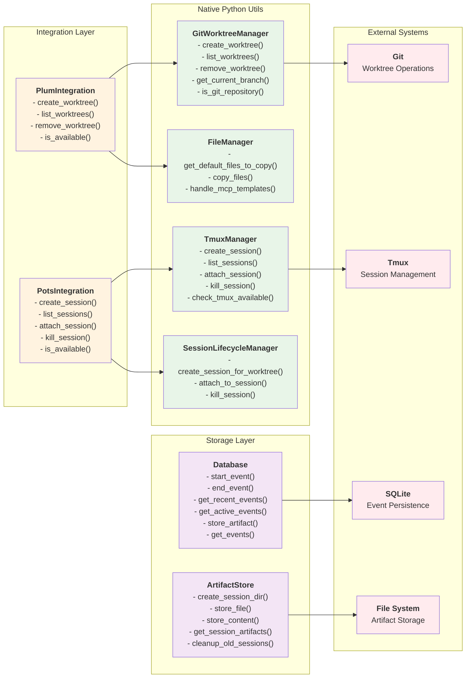

# PruneJuice Integration Components

This diagram shows the integration layer and how it connects to native Python utilities and external systems. The system has migrated from shell script dependencies to robust native Python implementations.

## Integration Architecture Benefits

1. **Native Python Implementation**: Replaced shell script dependencies with robust Python modules
2. **Clean Abstraction**: Integration layer provides simple interfaces while native utils handle complexity
3. **Cross-Platform Support**: Native Python implementations work across different operating systems
4. **Better Error Handling**: Python implementations provide more detailed error information
5. **Improved Testing**: Native Python code is easier to unit test than shell scripts
6. **Performance**: Reduced subprocess overhead by using native Git and system operations

## Key Components

- **PlumIntegration**: Git worktree management with native GitPython operations
- **PotsIntegration**: Tmux session lifecycle management with native tmux API calls
- **ArtifactStore**: Organized file storage with automatic cleanup and session management
- **Database**: Async SQLite operations for event tracking and history