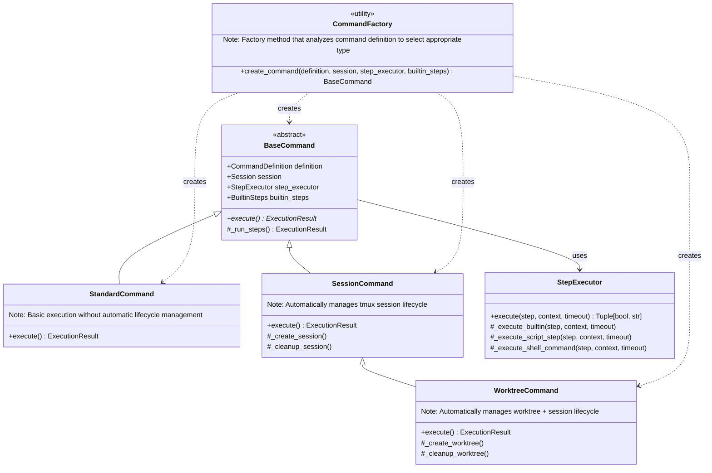

# PruneJuice Command Type Hierarchy

This diagram shows the command hierarchy and how different command types provide automatic lifecycle management for different use cases.

## Command Type Selection Logic

The `CommandFactory.create_command()` method automatically selects the appropriate command type based on:

1. **Step Analysis**: Examines all steps for specific action names:
   - `create-worktree` → triggers WorktreeCommand
   - `start-session` or `session-create` → triggers SessionCommand

2. **Command Name Patterns**:
   - Contains `worktree` or `feature-branch` → WorktreeCommand
   - Contains `session` → SessionCommand

3. **Dependency Chain**:
   - WorktreeCommand includes session management (inherits from SessionCommand)
   - SessionCommand includes basic execution (inherits from StandardCommand)

## Lifecycle Management

Each command type provides automatic resource management:

- **StandardCommand**: Basic step execution with no automatic lifecycle
- **SessionCommand**: Creates and cleans up tmux sessions automatically
- **WorktreeCommand**: Creates/cleans up both git worktrees AND tmux sessions

This design ensures that resources are properly managed regardless of whether steps succeed or fail.