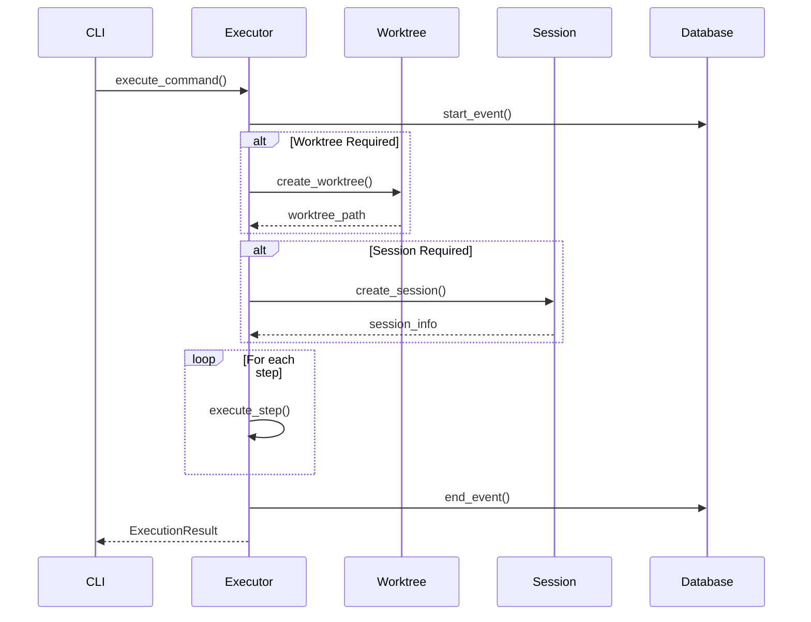

# System Architecture Overview

Prunejuice is built with a modular, layered architecture that emphasizes type safety, async operations, and native Python implementations. This document provides a comprehensive view of the system's design, components, and execution patterns.

## Design Principles

### Native Python First

- **No Shell Dependencies**: Pure Python implementation using modern libraries
- **Type Safety**: Comprehensive type hints throughout the codebase
- **Async by Design**: Built on asyncio for better performance and concurrency
- **Cross-Platform**: Works consistently across macOS, Linux, and Windows

### Modular Architecture

- **Layered Design**: Clear separation between CLI, core logic, and utilities
- **Plugin Architecture**: Extensible command and step system
- **Database Integration**: Event tracking and state persistence
- **Configuration Management**: Hierarchical configuration system

## System Overview

```
┌────────────────────────────────────────────────────────────┐
│                          CLI Layer                            │
│                      (prunejuice.cli)                       │
├────────────────────────────────────────────────────────────┤
│                        Core Models                          │
│                    (prunejuice.core)                       │
├────────────────────────────────────────────────────────────┤
│           Command System        │        Execution Engine     │
│         (commands.loader)       │       (core.executor)       │
├───────────────────────────────┼──────────────────────────────┤
│        Worktree Utils          │        Session Utils        │
│     (worktree_utils)           │      (session_utils)        │
├───────────────────────────────┼──────────────────────────────┤
│                    Database & State Management              │
│                 (core.database, core.state)                │
└────────────────────────────────────────────────────────────┘
```

## Core Components

### CLI Layer (`prunejuice.cli`)

The command-line interface built with Typer provides the user-facing API:

**Key Responsibilities:**
- Command-line argument parsing and validation
- User interaction and feedback
- Error handling and display
- Integration with core execution engine

**Main Commands:**
- `prj init` - Initialize new project
- `prj status` - Show project status
- `prj run <command>` - Execute commands
- `prj list-commands` - List available commands

### Core Models (`prunejuice.core`)

Pydantic-based data models provide type safety and validation:

#### Key Models

```python
# Command Definition Model
class ActionDefintion(BaseModel):
    name: str
    description: str
    category: str = "workflow"
    arguments: List[CommandArgument] = []
    environment: Dict[str, str] = {}
    steps: List[Union[str, ActionStep]] = []
    working_directory: Optional[str] = None
    timeout: int = 1800

# Execution Event Model
class ExecutionEvent(BaseModel):
    command: str
    project_path: str
    worktree_name: Optional[str] = None
    session_id: str
    artifacts_path: str
    metadata: Dict[str, Any] = {}
    status: str = "running"
    start_time: datetime
    end_time: Optional[datetime] = None

# Command Step Model
class ActionStep(BaseModel):
    name: str
    type: StepType = StepType.BUILTIN
    action: str
    args: Dict[str, Any] = {}
    timeout: int = 300
```

#### Step Types

- **BUILTIN**: Native Python implementations
- **SCRIPT**: External script execution
- **SHELL**: Direct shell command execution

### Command System (`prunejuice.commands`)

YAML-based command definition and loading system:

#### Command Loader (`commands.loader`)

```python
class CommandLoader:
    def load_commands(self, commands_dir: Path) -> Dict[str, ActionDefintion]
    def load_command(self, yaml_path: Path) -> ActionDefintion
    def validate_command(self, command: ActionDefintion) -> bool
```

**Features:**
- Recursive command discovery
- YAML validation and parsing
- Template variable expansion
- Command inheritance and extension

#### Command Structure

```
.prj/
├── commands/
│   ├── setup-dev.yaml
│   ├── feature-branch.yaml
│   └── deploy.yaml
├── steps/
│   ├── setup-environment.yaml
│   └── run-tests.yaml
└── configs/
    └── project.yaml
```

### Execution Engine (`core.executor`)

The async execution engine orchestrates command execution:

```python
class CommandExecutor:
    async def execute_command(
        self,
        command: ActionDefintion,
        args: Dict[str, Any],
        project_path: Path
    ) -> ExecutionResult
    
    async def execute_step(
        self,
        step: ActionStep,
        context: ExecutionContext
    ) -> StepResult
```

**Execution Flow:**
1. **Pre-execution**: Validate requirements, setup environment
2. **Worktree Management**: Create/configure worktrees if needed
3. **Session Management**: Setup tmux sessions if specified
4. **Step Execution**: Execute command steps in sequence
5. **Artifact Management**: Collect and store execution artifacts
6. **Cleanup**: Handle cleanup steps and error recovery

### Worktree Management (`worktree_utils`)

Native Python Git worktree operations:

#### GitWorktreeManager

```python
class GitWorktreeManager:
    def create_worktree(
        self,
        branch_name: str,
        base_branch: str = "main",
        parent_dir: Optional[Path] = None
    ) -> Path
    
    def list_worktrees(self) -> List[Dict[str, Any]]
    def remove_worktree(self, worktree_path: Path, force: bool = False) -> bool
    def get_worktree_info(self, worktree_path: Path) -> Optional[Dict[str, Any]]
```

**Key Features:**
- GitPython-based operations
- Automatic branch creation
- Conflict resolution
- Cleanup tracking

### Session Management (`session_utils`)

Native Python tmux session operations:

#### TmuxManager

```python
class TmuxManager:
    def create_session(
        self,
        session_name: str,
        working_dir: Path,
        auto_attach: bool = False
    ) -> bool
    
    def list_sessions(self) -> List[Dict[str, Any]]
    def session_exists(self, session_name: str) -> bool
    def attach_session(self, session_name: str) -> bool
    def kill_session(self, session_name: str) -> bool
```

**Session Features:**
- Automatic name sanitization
- Environment configuration
- Lifecycle management
- State tracking

### Database Layer (`core.database`)

SQLite-based event tracking and state persistence:

#### Database Schema

```sql
-- Event tracking
CREATE TABLE events (
    id INTEGER PRIMARY KEY AUTOINCREMENT,
    command TEXT NOT NULL,
    project_path TEXT NOT NULL,
    worktree_name TEXT,
    session_id TEXT,
    start_time DATETIME DEFAULT CURRENT_TIMESTAMP,
    end_time DATETIME,
    status TEXT CHECK(status IN ('running', 'completed', 'failed', 'cancelled')),
    artifacts_path TEXT,
    exit_code INTEGER,
    error_message TEXT,
    metadata TEXT -- JSON blob
);

-- Command definitions
CREATE TABLE command_definitions (
    id INTEGER PRIMARY KEY AUTOINCREMENT,
    name TEXT UNIQUE NOT NULL,
    description TEXT,
    yaml_path TEXT NOT NULL,
    yaml_hash TEXT,
    created_at DATETIME DEFAULT CURRENT_TIMESTAMP,
    updated_at DATETIME DEFAULT CURRENT_TIMESTAMP
);

-- Session tracking
CREATE TABLE sessions (
    id INTEGER PRIMARY KEY AUTOINCREMENT,
    session_name TEXT UNIQUE NOT NULL,
    project_path TEXT NOT NULL,
    worktree_name TEXT,
    tmux_session_id TEXT,
    created_at DATETIME DEFAULT CURRENT_TIMESTAMP,
    status TEXT CHECK(status IN ('active', 'detached', 'killed'))
);
```

**Database Operations:**
- Async connection management
- Secure parameter binding
- Event lifecycle tracking
- Query optimization with indexes

## Execution Flow

### Command Execution Sequence



### Step Execution Types

#### 1. Builtin Steps

Native Python implementations for common operations:

```python
# Example builtin step
async def execute_builtin_step(step: ActionStep, context: ExecutionContext):
    if step.action == "echo":
        message = step.args.get("message", "Hello")
        print(message)
        return StepResult(success=True, output=message)
```

#### 2. Script Steps

External script execution with environment management:

```python
# Script step execution
async def execute_script_step(step: ActionStep, context: ExecutionContext):
    script_path = resolve_script_path(step.action)
    process = await asyncio.create_subprocess_exec(
        str(script_path),
        stdout=asyncio.subprocess.PIPE,
        stderr=asyncio.subprocess.PIPE,
        env=context.environment
    )
    stdout, stderr = await process.communicate()
    return StepResult(
        success=process.returncode == 0,
        output=stdout.decode(),
        error=stderr.decode()
    )
```

#### 3. Shell Steps

Direct shell command execution:

```python
# Shell step execution
async def execute_shell_step(step: ActionStep, context: ExecutionContext):
    process = await asyncio.create_subprocess_shell(
        step.action,
        stdout=asyncio.subprocess.PIPE,
        stderr=asyncio.subprocess.PIPE,
        cwd=context.working_directory,
        env=context.environment
    )
    stdout, stderr = await process.communicate()
    return StepResult(
        success=process.returncode == 0,
        output=stdout.decode(),
        error=stderr.decode()
    )
```

## Configuration System

### Configuration Hierarchy

1. **Global Config** (`~/.config/prunejuice/config.yaml`)
2. **Project Config** (`.prj/configs/project.yaml`)
3. **Command Config** (command YAML files)
4. **Runtime Arguments** (command line arguments)

### Configuration Loading

```python
class ConfigManager:
    def load_config(self, project_path: Path) -> ProjectConfig:
        # Load in priority order
        global_config = self.load_global_config()
        project_config = self.load_project_config(project_path)
        
        # Merge configurations
        return self.merge_configs(global_config, project_config)
```

### Template System

Configuration supports Jinja2-style templates:

```yaml
worktree:
  branch: "{{task_type}}-{{issue_number}}"
  base_branch: "{{base_branch | default('main')}}"
  
session:
  name_template: "{{project}}-{{worktree}}-{{task}}"
  working_directory: "{{worktree_path | default(project_path)}}"
```

## Error Handling

### Error Types

```python
class StepError(Exception):
    """Exception raised when a step fails."""
    pass

class WorktreeError(Exception):
    """Exception raised during worktree operations."""
    pass

class SessionError(Exception):
    """Exception raised during session operations."""
    pass

class ConfigurationError(Exception):
    """Exception raised for configuration issues."""
    pass
```

### Error Recovery

```python
# Cleanup on failure
async def execute_with_cleanup(command: ActionDefintion, context: ExecutionContext):
    try:
        result = await execute_command_steps(command, context)
        return result
    except Exception as e:
        # Execute cleanup steps
        await execute_cleanup_steps(command.cleanup_on_failure, context)
        raise e
```

## Logging and Monitoring

### Logging Configuration

```python
import logging

# Configure structured logging
logging.basicConfig(
    level=logging.INFO,
    format='%(asctime)s - %(name)s - %(levelname)s - %(message)s',
    handlers=[
        logging.FileHandler('~/.local/share/prunejuice/logs/debug.log'),
        logging.StreamHandler()
    ]
)
```

### Event Tracking

All significant events are tracked in the database:

- **Command executions** with timing and status
- **Worktree operations** with branch and path information
- **Session lifecycle** events
- **Error conditions** with stack traces
- **Performance metrics** for optimization

## Extensibility

### Custom Step Types

Extend the system with custom step implementations:

```python
# Register custom step executor
from prunejuice.core.executor import register_step_executor

@register_step_executor("custom")
async def execute_custom_step(step: ActionStep, context: ExecutionContext):
    # Custom implementation
    return StepResult(success=True)
```

### Plugin Architecture

Load external plugins for extended functionality:

```python
# Plugin discovery
from prunejuice.plugins import discover_plugins

plugins = discover_plugins()
for plugin in plugins:
    plugin.register(executor)
```

### Integration Points

- **Custom step executors** for domain-specific operations
- **Worktree providers** for alternative VCS systems
- **Session managers** for alternative terminal multiplexers
- **Artifact handlers** for custom output processing

## Security Considerations

### Input Validation

- **Command validation** through Pydantic models
- **Path sanitization** for all file operations
- **Parameter binding** in database queries
- **Environment isolation** in step execution

### Permission Management

- **File system permissions** validated before operations
- **Git repository access** controlled through user permissions
- **Tmux session isolation** per user/project
- **Configuration access** restricted to appropriate directories

## Performance Characteristics

### Async Operations

- **Concurrent step execution** where safe
- **Non-blocking I/O** for file and network operations
- **Database connection pooling** for better throughput
- **Background cleanup** operations

### Resource Management

- **Memory-efficient** streaming for large outputs
- **Disk space monitoring** for worktree operations
- **Process lifecycle** management for spawned commands
- **Connection cleanup** for external resources

## Testing Architecture

### Test Structure

```
tests/
├── unit/
│   ├── test_models.py
│   ├── test_executor.py
│   └── test_database.py
├── integration/
│   ├── test_worktree_integration.py
│   └── test_session_integration.py
└── fixtures/
    ├── sample_commands/
    └── test_projects/
```

### Test Patterns

- **Unit tests** for individual components
- **Integration tests** for component interactions
- **End-to-end tests** for complete workflows
- **Property-based testing** for edge cases

## Migration and Compatibility

### Legacy Script Migration

Prunejuice provides tools for migrating from shell-based workflows:

1. **Script analysis** to identify command patterns
2. **YAML generation** from existing scripts
3. **Validation tools** to ensure compatibility
4. **Gradual migration** support

### Version Compatibility

- **Configuration versioning** for breaking changes
- **Backward compatibility** for stable APIs
- **Migration scripts** for major version upgrades
- **Deprecation warnings** for obsolete features

This architecture provides a solid foundation for scalable, maintainable development workflow automation while ensuring type safety, performance, and extensibility.

## Related Documentation

### Core Concepts
- **[Git Worktrees](worktrees.md)** - Deep dive into worktree management and integration
- **[Tmux Sessions](sessions.md)** - Session lifecycle and automation details

### Implementation Guides  
- **[Command Definition](../guides/command-definition.md)** - How to define and structure commands
- **[Step Creation](../guides/step-creation.md)** - Creating custom step implementations
- **[Project Setup](../guides/project-setup.md)** - Project organization and configuration

### Reference Documentation
- **[Configuration Options](../reference/config.md)** - Complete configuration system documentation
- **[YAML Schema](../reference/yaml-schema.md)** - Command and step schema reference
- **[CLI Commands](../reference/commands.md)** - Complete command-line interface reference

### Advanced Topics
- **[Custom Integrations](../advanced/custom-integrations.md)** - Extending Prunejuice with external tools
- **[MCP Server](../advanced/mcp-server.md)** - Exposing commands via Model Context Protocol
- **[Troubleshooting](../advanced/troubleshooting.md)** - System debugging and problem resolution